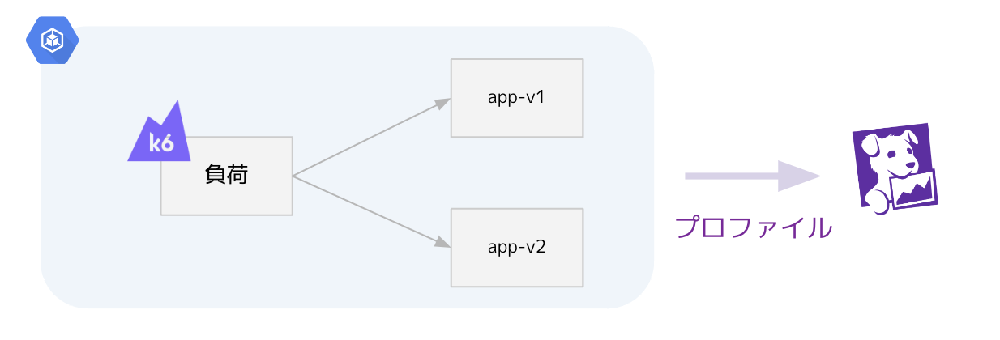
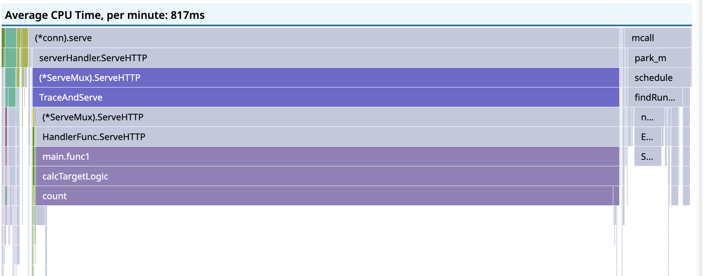
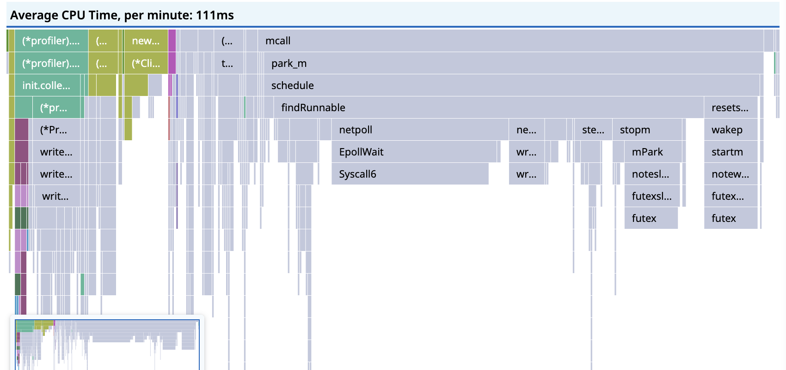
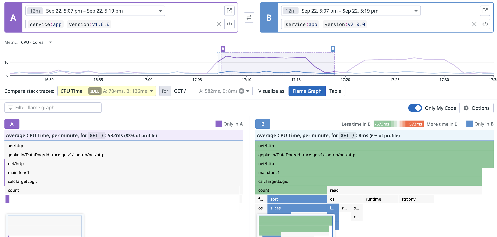

## Overview

[オブザーバビリティ実践までの道のり〜各社の課題とアプローチ方法とは？〜 Lunch LT](https://findy.connpass.com/event/328935/) で使うデモ用のリポジトリです。

発表スライドは以下です。

https://speakerdeck.com/k6s4i53rx/getting-started-profile-o11y

※ 注意：デモ用のため取り扱いには注意してください。

## Requirements
- Datadog Agent / Backend
- Kubernets Engine

## Deployments
- App
```sh
# deploy configmap
$ kubectl apply -f deployments/configmap.yaml

# deploy v1 app 
$ kubectl apply -f deployments/app-v1.yaml

# deploy v2 app
$ kubectl apply -f deployments/app-v2.yaml
```

- Load Generator
```sh
# deploy k6
$ kubectl apply -f deployments/k6-configmap.yaml
$ kubectl apply -f deployments/k6.yaml
```

## Architecture



## Output
### profile of the v1 app


### profile of the v2 app


### diff v2 based v1
